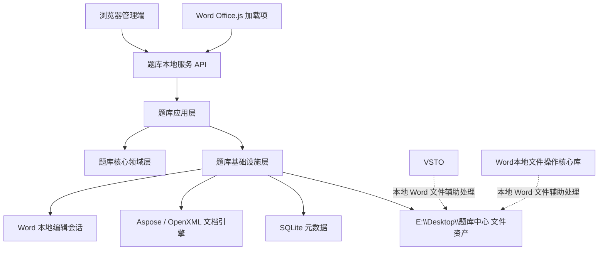
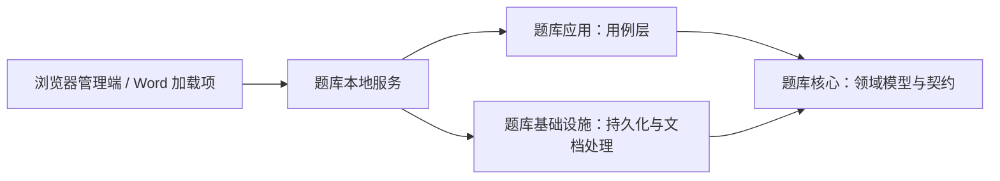
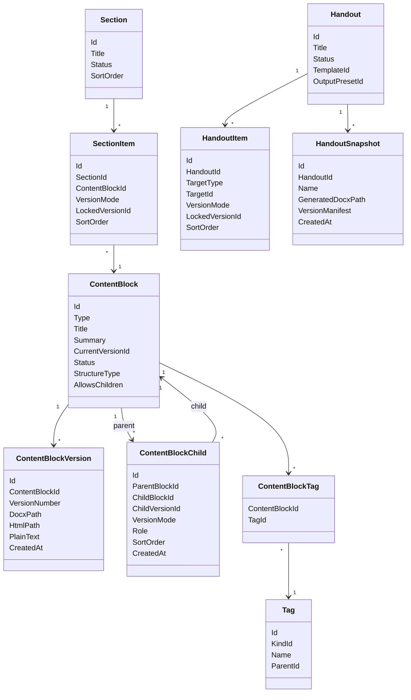
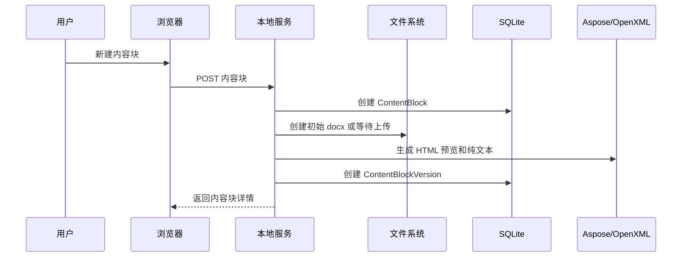
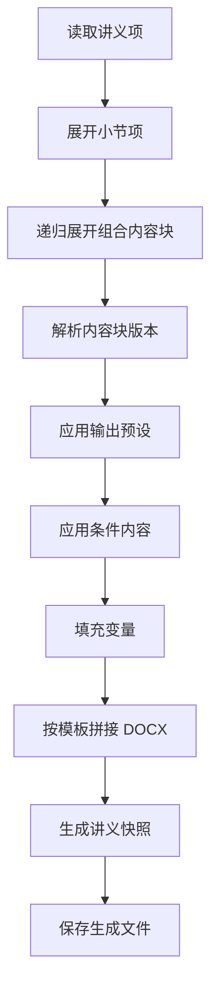

# 内容管理系统详细架构

## 1. 架构定位

本系统的目标不是继续把现有题库插件做大，而是把解决方案升级为一个面向讲义生产的内容管理系统。

目标形态：

> 以浏览器为主工作台，以 Word 为精细编辑器，以 `.docx` 内容块为核心资产，以小节和讲义为组织与输出单元的本地讲义内容管理系统。

核心原则：

- Word 负责精细编辑和最终输出，不负责长期结构管理。
- 浏览器负责内容块管理、小节编排、讲义编排、审查、搜索、引用关系和版本。
- 后端负责内容资产保存、元数据、版本、引用关系、预览生成和 Word 拼接输出。
- 内容块主资产保存为完整 Word 文件，公式、图片、表格、排版都保留在 `.docx` 内。
- 内容块分为原子块和组合块；组合块通过引用组织子内容块，不把子块正文复制进自身文件。
- 内容块嵌套必须禁止循环引用，并限制最大展开深度，防止结构失控。
- 内容块的章节归属、难度、来源、附加标签等统一进入标签体系，通过关系表挂接，不在内容块主表中写死章节字段。
- 浏览器不以上传 `.docx` 作为主要编辑方式；内容块正文编辑优先通过本地 Word 编辑会话完成。
- Word 本地编辑会话由后端创建临时编辑文件并打开 Word，用户关闭 Word 文档后后端再同步为内容块新版本。
- 不建设独立媒体资源库。
- `E:\Desktop\题库中心` 暂时保持硬编码，等系统可用后再配置化。

### 1.1 阶段 5.6 概念校准

当前仓库已经推进到讲义内容管理与编排系统。系统不是普通题库系统、普通 CRUD 后台、多人 SaaS 系统，也不是原生桌面软件。

系统应定位为：

> 面向高中物理教学的本地讲义内容管理与编排系统。

核心特征：

- 浏览器页面是主要工作台。
- Word 是精细内容编辑器和最终讲义承载格式。
- `.docx` 内容块是长期保存的核心内容资产。
- 内容块可以是原子块，也可以是组合块。
- 小节用于组织一个教学主题下的讲解结构。
- 讲义用于组织一次具体输出材料。
- 系统重点不是“录入题目”，而是“复用内容块、编排小节、生成讲义，并在编排过程中快速补缺和修改”。
- 本系统是个人本地工作系统，不按多人协作、权限系统、云端 SaaS 方向设计。
- 系统主要运行在宽屏浏览器页面中；窄屏、Office 任务窗格或窗口宽度不足时，部分导航可以退化为 Drawer 抽屉面板。

### 1.2 必须区分的核心概念

#### TeachingTopic 教学主题

`TeachingTopic` 表示教学内容在知识结构中的位置，例如：

```text
功能关系
机械能守恒
竖直圆轨道
杆模型
球模型
```

教学主题的职责是“定位”，不是直接承载所有编辑对象。教学主题树不应该直接混入小节方案、讲义方案、内容块版本、讲义版本或生成记录。

当前代码中可能仍通过标签、章节或页面静态数据表达类似概念；文档层面先明确目标概念，不代表本轮实现独立 `TeachingTopic` 模型。

#### ContentBlock 内容块

`ContentBlock` 是可复用内容资产，可以是知识点、例题、练习、方法总结、易错点、普通说明、题目或组合块。内容块可以被小节引用，也可以被讲义直接引用。

#### Section 小节

`Section` 回答的问题是：“这个教学主题应该怎么讲？”

小节是教学组织单元，不是最终输出材料。小节内部按顺序引用内容块，例如知识点、例题组、练习、下级模型入口。

#### SectionPlan 小节方案

`SectionPlan` 是目标概念，用于表达同一个教学主题下的多个并列小节方案，例如：

```text
机械能守恒：基础讲解版
机械能守恒：提高班版
机械能守恒：一轮复习版
机械能守恒：模型专题版
```

这些是不同教学用途的并列方案，不是历史版本。当前阶段若暂时用 `Section` 承载这类概念，这是阶段性映射，不是最终领域结论。

#### Handout 讲义

`Handout` 回答的问题是：“这份材料应该怎么输出？”

讲义可以引用小节、内容块、组合内容块。讲义不是教学主题，也不是小节。

#### HandoutPlan 讲义方案

`HandoutPlan` 是目标概念，用于表达同一个教学主题下关联的多份讲义，例如：

```text
机械能守恒专题讲义
功能关系单元复习讲义
圆轨道专项讲义
```

这些是不同输出用途的讲义方案，不应该挂进教学主题树当作教学主题节点。当前阶段若暂时用 `Handout` 承载这类概念，这是阶段性映射。

#### Variant 方案/变体 与 Version 版本

`Variant` 表示不同用途的并列对象，例如基础讲解版、提高班版、一轮复习版。

`Version` 表示同一个对象的历史记录，例如内容块 v1/v2/v3、讲义生成记录、未来的讲义快照。

版本不应该作为主导航节点显示。

### 1.3 讲义展开小节的规则

讲义可以引用小节。当讲义编排树展开小节时，展开出来的知识点、例题、练习默认是“引用展开视图”，不是讲义自己真实拥有的子节点。

规则：

1. 讲义直接拥有的是 `HandoutItem`。
2. 如果 `HandoutItem` 引用小节，那么小节下的内容块是展开预览。
3. 用户在讲义中移除小节，只删除讲义引用，不删除源小节。
4. 用户在讲义中编辑某个内容块时，编辑的是源内容块。
5. 当前阶段不生成讲义内局部副本。
6. 未来如果需要“复制为讲义内独立副本”，应作为单独能力设计。

调整讲义结构不能反向修改源小节结构。

### 1.4 页面模式不是固定三栏

系统不是所有页面都固定为“左侧教学主题树 + 中间主区域 + 右侧上下文详情面板”。

- 教学主题工作台：左侧教学主题树，中间主题工作台主区域，右侧无常驻上下文面板。
- 小节编辑器：教学主题树默认折叠，左侧主栏显示小节结构树，中间显示小节展开内容，右侧显示当前选中块详情。
- 讲义编辑器：教学主题树默认折叠，左侧主栏显示讲义结构树，中间显示讲义展开内容，右侧显示当前选中节点详情。

## 2. 总体架构



系统分为两个正式入口：

- 浏览器管理端：主要使用入口。
- Word 加载项：辅助编辑入口。

另有两个保留项目：

- `VSTO`
- `Word本地文件操作核心库`

这两个项目后续继续使用，但定位为本地文件辅助处理能力，不纳入新内容管理系统的核心架构。

## 3. 项目边界

### 3.1 主线项目

```text
题库核心
题库应用
题库基础设施
题库本地服务
question-bank-office-addin
后续新增浏览器管理端
```

### 3.2 保留但不纳入主架构

```text
VSTO
Word本地文件操作核心库
```

定位：

- 处理本地 Word 文件。
- 承担必要的本机 Office 自动化辅助能力。
- 不作为浏览器内容管理系统的领域模型、API 或主流程依赖。

### 3.3 暂时搁置或按需处理

```text
Core.QuestionBank
TagRunner
tools/旧题库迁移工具
```

这些项目不作为当前升级主线，除非后续迁移历史数据或复用老逻辑时再局部启用。

补充约束：
- `Core.QuestionBank` 只作为历史代码参考，不接收新主线功能。
- 新功能默认进入 `题库核心`、`题库应用`、`题库基础设施`、`题库本地服务` 或 `question-bank-office-addin`。

## 4. 分层架构



依赖边界：
- `题库应用` 只依赖 `题库核心` 中的领域模型与契约，不新增对 `题库基础设施` 的项目引用。
- `题库基础设施` 实现 `题库核心` 中的接口契约。
- `题库本地服务` 是组合根，负责注册应用用例与基础设施实现。

### 4.1 题库本地服务

职责：

- 启动本地 ASP.NET Core 服务。
- 托管 API。
- 托管浏览器管理端静态资源。
- 托管现有 Office 加载项静态资源。
- 注册依赖注入。
- 初始化题库实例。

当前硬编码保留：

```csharp
var 题库中心根目录 = @"E:\Desktop\题库中心";
```

后续系统可用后再迁移到配置文件。

### 4.2 题库应用

职责：

- 承载业务用例。
- 编排领域对象、仓储和文档处理服务。
- 不直接依赖具体文件路径和数据库实现。
- 新增能力需要基础设施实现时，先在 `题库核心` 定义契约，再由 `题库基础设施` 实现并在 `题库本地服务` 注册。

未来模块：

```text
内容块模块
内容块组合模块
小节模块
讲义模块
版本模块
引用关系模块
输出模块
健康检查模块
搜索模块
Word编辑会话模块
```

### 4.3 题库核心

职责：

- 领域模型。
- 领域规则。
- 接口契约。

未来新增核心模型：

```text
TeachingTopic
ContentBlock
ContentBlockVersion
ContentBlockChild
ContentBlockTag
Section
SectionPlan（目标概念，当前阶段可由 Section 阶段性承载）
SectionItem
Handout
HandoutPlan（目标概念，当前阶段可由 Handout 阶段性承载）
HandoutItem
HandoutSnapshot
OutputPreset
Template
VariableSet
```

### 4.4 题库基础设施

职责：

- SQLite 数据访问。
- `.docx` 文件存储。
- HTML 预览生成。
- 纯文本索引提取。
- Word 讲义拼接生成。
- Word 本地编辑会话文件管理。
- 本地 Word 启动。
- 编辑文件关闭检测与同步。
- Aspose / OpenXML 封装。

当前已有能力可以复用：

- 题目 `.docx` 保存。
- 题目 HTML 预览。
- OOXML 转 `.docx`。
- `.docx` 转 Flat OPC / OOXML。
- 题库实例路径管理。

现实边界：
- 现有 `题库应用/试卷导入模块/试卷解析` 中直接使用 Aspose 的历史实现暂时保留。
- 新增内容块、讲义、浏览器管理端相关能力时，仍优先通过 `题库核心` 契约调用基础设施实现。
- 不因为新增内容管理能力而立即迁移旧试卷解析器。

## 5. 核心领域模型

### 5.1 内容块 ContentBlock

内容块是系统的基本可复用资产。原子块是最小正文资产，组合块是可复用的引用结构资产。

内容块类型：

```text
知识点
例题
练习
方法总结
易错点
普通说明
题目
```

核心字段：

```text
Id
类型
标题
摘要
当前版本Id
状态
结构类型
是否允许子块
创建时间
更新时间
```

内容块状态：

```text
草稿
待审查
可复用
需修订
已废弃
```

内容块结构类型：

```text
原子块
组合块
```

设计规则：

- 原子块以自身 `.docx` 为完整正文，不允许嵌套其他内容块。
- 组合块以引用结构为主体，可按顺序包含多个子内容块。
- `题目` 默认是原子块，不允许子块。
- `小节`、`题组`、`练习组`、`专题片段` 这类内容应建模为组合块。
- 类型和结构类型不完全绑定，但 API 必须校验“不允许子块”的内容块不能添加子项。
- 组合块自身可以有一个可选正文 `.docx`，用于保存导语、说明或过渡文字；子块仍通过引用插入，不物理复制。

### 5.2 内容块标签 ContentBlockTag

内容块标签表示内容块与现有标签体系之间的归属关系。章节、难度、来源、附加标签、做题方法等都通过标签挂接。

核心字段：

```text
内容块Id
标签Id
```

设计规则：

- 内容块主表不新增固定的“章节字段”。
- 章节属于标签种类，允许树形层级，例如：动量 -> 动量定理。
- 难度、年份、来源等单选标签种类仍保持单选规则。
- 待整理标签不进入正式内容块标签流程。
- 标签如果已被内容块引用，不能直接删除。
- 内容库列表可以按标签筛选；后续小节、讲义也应复用同一套标签体系。

### 5.3 内容块版本 ContentBlockVersion

内容块每次保存形成一个版本。

核心字段：

```text
Id
内容块Id
版本号
Docx路径
Html预览路径
纯文本内容
创建时间
是否当前版本
```

设计规则：

- 每个内容块至少有一个版本。
- 讲义和小节可以跟随内容块最新版本，也可以锁定某一版本。
- 修改内容块不直接覆盖历史版本。

### 5.4 内容块子项 ContentBlockChild

内容块子项表示“父内容块包含子内容块”的有序引用关系，是多层嵌套的基础。

核心字段：

```text
Id
父内容块Id
子内容块Id
子内容块版本Id
引用版本模式
角色
排序
创建时间
```

引用版本模式：

```text
跟随最新
锁定版本
```

角色示例：

```text
知识点
例题
练习
说明
题组
小节
```

设计规则：

- 父内容块必须允许子块。
- 子内容块可以是原子块，也可以是组合块。
- 当引用模式为“锁定版本”时，必须记录 `子内容块版本Id`。
- 当引用模式为“跟随最新”时，导出和预览时解析子内容块当前版本。
- 删除子项只删除引用关系，不删除子内容块本身。
- 添加或移动子项时必须做循环检测。

### 5.5 小节 Section

小节是基本教学组织单元。

典型结构：

```text
知识点 -> 例题 -> 练习
```

核心字段：

```text
Id
标题
所属章节或专题
排序
状态
创建时间
更新时间
```

### 5.6 小节项 SectionItem

小节项表示小节内部对内容块的有序引用。

核心字段：

```text
Id
小节Id
内容块Id
引用版本模式
锁定版本Id
排序
条件标签
```

引用版本模式：

```text
跟随最新
锁定版本
```

### 5.7 讲义 Handout

讲义是输出单元。

核心字段：

```text
Id
标题
摘要
状态
创建时间
更新时间
```

讲义状态：

```text
草稿
可生成
已归档
```

当前阶段暂不落地模板Id和输出预设Id，后续在输出预设阶段补充。

### 5.8 讲义项 HandoutItem

讲义项表示讲义内部引用的小节或单个内容块。

核心字段：

```text
Id
讲义Id
目标类型
目标Id
引用版本模式
锁定内容块版本Id
角色
排序
```

目标类型：

```text
小节
内容块
```

### 5.9 讲义快照 HandoutSnapshot

讲义快照是某次发布或生成时的固定版本。

当前阶段先落地轻量生成记录 `HandoutGenerations`，保存生成文件路径和版本清单 JSON；正式 `HandoutSnapshot` 后续在引用关系与版本阶段扩展。

核心字段：

```text
Id
讲义Id
快照名称
生成文件路径
使用的内容块版本清单
输出预设Id
模板Id
创建时间
```

设计规则：

- 已发布快照不随内容块后续更新自动变化。
- 后续内容块更新只提示影响，不改变历史快照。

### 5.10 输出预设 OutputPreset

输出预设用于同一套内容生成不同版本。

典型预设：

```text
学生版
教师版
解析版
练习版
复习版
```

核心字段：

```text
Id
名称
包含知识点
包含例题
包含练习
包含答案
包含解析
条件规则
```

### 5.11 变量集 VariableSet

变量集用于生成讲义时填充动态信息。

示例变量：

```text
讲义标题
班级
教师
日期
学科
学段
```

核心字段：

```text
Id
名称
变量键
变量值
```

## 6. 领域关系



## 7. 文件存储架构

根目录暂定：

```text
E:\Desktop\题库中心\{题库键}
```

未来结构：

```text
E:\Desktop\题库中心\{题库键}
  question-bank.db

  content-blocks\
    source\
      {内容块ID}\
        v1.docx
        v2.docx
    html\
      {内容块ID}\
        v1.html
        v2.html
    text\
      {内容块ID}\
        v1.txt
        v2.txt

  handouts\
    generated\
      {讲义ID}\
        {讲义标题}-{yyyyMMddHHmmss}.docx

  templates\
    handout-default.docx
    student-default.docx
    teacher-default.docx
    answer-default.docx

  temp\
    edit-sessions\
    import-sessions\
    edit-sessions\
      {会话ID}\
        content.docx
        session.json
```

兼容当前结构：

```text
source\
  {题目ID}.docx
html\
  {题目ID}.html
```

迁移策略：

- 第一阶段保留旧题目文件结构。
- 新内容块使用新目录。
- 后续可将旧题目逐步迁移为内容块。

稳定性约束：

- 新增内容块目录时，不修改现有 `source` 和 `html` 的语义。
- 不替换 `题库路径提供器` 中已有的题目文件路径方法；如需支持新目录，应新增专用方法。
- 题目录入、题目预览、试卷导入等已有流程不随内容块目录调整而迁移。

## 8. API 架构

建议 API 分组：

```text
/api/题库实例
/api/内容块
/api/内容块/{id}/版本
/api/内容块/{id}/子块
/api/内容块/{id}/结构树
/api/内容块/{id}/引用
/api/小节
/api/小节/{id}/项目
/api/讲义
/api/讲义/{id}/项目
/api/讲义/{id}/生成
/api/讲义/{id}/快照
/api/引用关系/旧版本引用
/api/输出预设
/api/模板
/api/变量集
/api/标签
/api/搜索
/api/健康检查
/api/Word编辑会话
```

### 8.1 内容块 API

```text
GET    /api/题库实例/{题库键}/内容块
POST   /api/题库实例/{题库键}/内容块
GET    /api/题库实例/{题库键}/内容块/{id}
PUT    /api/题库实例/{题库键}/内容块/{id}
DELETE /api/题库实例/{题库键}/内容块/{id}

POST   /api/题库实例/{题库键}/内容块/{id}/版本
GET    /api/题库实例/{题库键}/内容块/{id}/版本
GET    /api/题库实例/{题库键}/内容块/{id}/预览html
GET    /api/题库实例/{题库键}/内容块/{id}/文件base64
GET    /api/题库实例/{题库键}/内容块/{id}/引用

GET    /api/题库实例/{题库键}/内容块/{id}/标签
PUT    /api/题库实例/{题库键}/内容块/{id}/标签

GET    /api/题库实例/{题库键}/内容块/{id}/子块
POST   /api/题库实例/{题库键}/内容块/{id}/子块
PUT    /api/题库实例/{题库键}/内容块/{id}/子块排序
DELETE /api/题库实例/{题库键}/内容块/{id}/子块/{子项Id}
GET    /api/题库实例/{题库键}/内容块/{id}/结构树

POST   /api/题库实例/{题库键}/内容块/编辑会话
POST   /api/题库实例/{题库键}/内容块/{id}/编辑会话
GET    /api/题库实例/{题库键}/内容块/编辑会话/{会话ID}
POST   /api/题库实例/{题库键}/内容块/编辑会话/{会话ID}/同步
POST   /api/题库实例/{题库键}/内容块/编辑会话/{会话ID}/取消
```

### 8.2 小节 API

```text
GET    /api/题库实例/{题库键}/小节
POST   /api/题库实例/{题库键}/小节
GET    /api/题库实例/{题库键}/小节/{id}
PUT    /api/题库实例/{题库键}/小节/{id}
DELETE /api/题库实例/{题库键}/小节/{id}

GET    /api/题库实例/{题库键}/小节/{id}/项目
POST   /api/题库实例/{题库键}/小节/{id}/项目
PUT    /api/题库实例/{题库键}/小节/{id}/项目排序
DELETE /api/题库实例/{题库键}/小节/{id}/项目/{itemId}
GET    /api/题库实例/{题库键}/小节/{id}/预览html
```

### 8.3 讲义 API

```text
GET    /api/题库实例/{题库键}/讲义
POST   /api/题库实例/{题库键}/讲义
GET    /api/题库实例/{题库键}/讲义/{id}
PUT    /api/题库实例/{题库键}/讲义/{id}
DELETE /api/题库实例/{题库键}/讲义/{id}

GET    /api/题库实例/{题库键}/讲义/{id}/项目
POST   /api/题库实例/{题库键}/讲义/{id}/项目
PUT    /api/题库实例/{题库键}/讲义/{id}/项目排序
DELETE /api/题库实例/{题库键}/讲义/{id}/项目/{itemId}
POST   /api/题库实例/{题库键}/讲义/{id}/生成
GET    /api/题库实例/{题库键}/讲义/{id}/生成记录
GET    /api/题库实例/{题库键}/讲义/{id}/生成记录/{生成记录ID}/文件
POST   /api/题库实例/{题库键}/讲义/{id}/发布快照
GET    /api/题库实例/{题库键}/讲义/{id}/快照
GET    /api/题库实例/{题库键}/讲义/{id}/下载/{snapshotId}
```

### 8.4 引用关系 API

```text
GET    /api/题库实例/{题库键}/内容块/{id}/引用
GET    /api/题库实例/{题库键}/引用关系/旧版本引用
```

当前实现策略：

- 不维护独立引用缓存表。
- 内容块影响范围从组合块子项、小节项和讲义项动态推导。
- 讲义通过小节间接引用内容块时，也会进入影响范围。
- 旧版本审查只读展示，不自动改写引用模式。

## 9. 前端页面架构

### 9.1 浏览器管理端

阶段边界：

- v0 阶段浏览器管理端优先复用现有 `question-bank-office-addin` 构建链路或 `题库本地服务/wwwroot` 静态托管方式。
- 除非明确决策，不新增独立前端项目。

当前已落地入口：

```text
http://localhost:5282/cms.html
```

当前已落地页面能力：

```text
内容块列表
类型、状态、关键词筛选
内容块分类标签筛选
内容块详情
内容块元数据编辑
内容块分类标签编辑
按标签筛选内容块
Word 本地编辑会话
HTML 预览
组合块子块管理
组合块结构树
内容块版本列表
小节列表
小节元数据编辑
小节内容块编排
小节整体 HTML 预览
讲义列表
讲义元数据编辑
讲义引用小节或内容块
讲义项目排序和移除
讲义 Word 生成
讲义生成记录下载
内容块影响范围
旧版本锁定引用审查
```

当前浏览器页面仍定位为阶段性工作台，不是最终独立前端项目。

当前已落地入口：

```text
内容库：http://localhost:5282/cms.html
小节编辑器：http://localhost:5282/sections.html
讲义编排器：http://localhost:5282/handouts.html
引用审查：http://localhost:5282/references.html
```

主页面：

```text
内容库
内容块详情
小节编辑器
讲义编排器
引用关系视图
版本审查页
输出设置
模板管理
变量管理
健康检查
标签与章节管理
```

推荐导航结构：

```text
工作台
内容库
小节
讲义
标签
模板
健康检查
设置
```

### 9.2 页面入口与目标路由语义

当前阶段仍以多个静态页面入口为主：

```text
cms.html
sections.html
handouts.html
references.html
```

目标形态可以是同一个浏览器应用、同一个布局外壳、不同业务对象使用不同 route 路由。本轮只校准文档，不要求实现 route，也不要求引入新的前端框架。

推荐目标 route 语义：

```text
/app/topics/:topicId
  显示教学主题工作台。

/app/section-plans/:sectionPlanId
  显示小节方案编辑器。

/app/handouts/:handoutId
  显示讲义编辑器。

/app/content-blocks/:contentBlockId
  显示内容块详情。

/app/references
  显示引用审查。
```

### 9.3 当前差异记录

- 当前仓库已有 `cms.html`、`sections.html`、`handouts.html`、`references.html` 等页面入口。
- 目标形态中存在 `/app/topics/:topicId`、`/app/section-plans/:sectionPlanId`、`/app/handouts/:handoutId` 等 route 语义，但当前不要求实现。
- 当前已有 `Section` 和 `Handout`，但 `SectionPlan` 和 `HandoutPlan` 仍是目标概念。
- 当前讲义编排主树已完成第一版，但 UI 信息架构仍需统一。
- 当前文档如果直接进入阶段 6，应改为先完成阶段 5.6。

### 9.4 Word 加载项

阶段边界：

- 阶段 0-4 中，Word 加载项只保持现有题目录入、插入和预览相关能力可用。
- 下列内容块编辑能力属于阶段 8，不应在早期任务中提前实现。

职责：

- 从 Word 选区创建内容块。
- 更新已有内容块。
- 插入内容块到当前 Word 文档。
- 打开内容块编辑会话。
- 用内容控件标记内容块来源。

内容控件标记建议：

```text
内容块ID={id}
小节ID={id}
讲义引用ID={id}
```

当前已有 `题目ID={id}` 的机制，后续可以泛化。

## 10. 核心工作流

### 10.1 新建内容块



### 10.2 Word 本地编辑会话

```text
打开内容块
-> 后端创建 edit-session/content.docx
-> 新建内容块时创建空白 docx，编辑已有内容块时复制当前版本 docx
-> 后端使用系统文件关联打开 Word
-> 用户在 Word 中编辑并保存
-> 用户关闭 Word 文档
-> 后端检测 Word 锁文件消失、文件可读且稳定
-> 后端计算文件 hash
-> hash 变化则保存为内容块新版本
-> 更新 HTML 预览
-> 更新纯文本索引
-> 页面通过会话状态感知“已同步 / 无变化 / 失败”
```

设计规则：

- 不依赖 Word 进程退出，因为 Word 可能复用既有进程。
- 第一版会话保存在内存中，`session.json` 只用于调试和人工排查。
- 自动同步发生在 Word 文档关闭后，不在每次 `Ctrl+S` 时生成版本。
- `FileSystemWatcher` 只作为提示信号，后台扫描每隔数秒兜底检查所有编辑中会话。
- 阶段 2.1 暂不修改 CORS，不加入 token 或来源限制，先保证本机工作流稳定。

### 10.3 组合内容块编排

```text
新建组合内容块
-> 添加子内容块
-> 选择跟随最新或锁定版本
-> 系统校验父块允许子块
-> 系统校验不会产生循环嵌套
-> 拖拽调整子块顺序
-> 递归展开生成结构预览
```

组合块的核心不是复制子块正文，而是保存引用结构。导出、预览和生成讲义时，系统按引用关系递归读取子块版本并临时拼接。

### 10.4 小节编排

```text
新建小节
-> 添加知识点内容块
-> 添加例题内容块
-> 添加练习内容块
-> 拖拽排序
-> 审查小节预览
```

### 10.5 讲义编排

```text
新建讲义
-> 添加小节
-> 可插入单个内容块
-> 选择输出预设
-> 选择 Word 模板
-> 预览结构
-> 生成 Word
```

### 10.6 讲义生成



### 10.7 发布快照

```text
草稿讲义
-> 生成 Word
-> 记录本次使用的内容块版本清单
-> 保存 HandoutSnapshot
-> 后续内容块更新不自动改变历史快照
```

## 11. 引用与版本规则

### 11.1 引用模式

```text
跟随最新版本
锁定指定版本
```

默认建议：

- 小节中的内容块默认跟随最新版本。
- 组合内容块中的子块默认跟随最新版本。
- 已发布讲义快照锁定生成时使用的版本。
- 讲义草稿可以选择跟随最新或锁定版本。

### 11.2 嵌套与循环规则

内容块允许像 Notion 一样多层组合，但必须有明确边界：

- `原子块` 不能添加子内容块。
- `题目` 默认作为原子块处理，不允许嵌套子块。
- `组合块` 可以添加原子块或组合块作为子块。
- 添加 `父块 A -> 子块 B` 时，必须检查 `B` 的所有下级是否已经包含 `A`；如果包含则拒绝。
- 默认最大嵌套深度先设为 10 层，超过时拒绝保存或在健康检查中报错。
- 组合块预览和导出时递归展开子块，但不把子块正文复制进父块的源 `.docx`。
- 同一父块下可以重复引用同一子块，但需要在 UI 中明确提示，避免误操作。

### 11.3 修改共享内容时的提示

当内容块被多个地方引用时，编辑前或保存后应显示影响范围：

```text
该内容块被以下位置引用：
- 小节：动量
- 讲义：动量定理基础内容
- 讲义：碰撞专题复习
```

### 11.4 废弃内容规则

- 已废弃内容块不应出现在默认添加列表。
- 已废弃但仍被引用的内容块进入健康检查报告。
- 已发布快照可以继续保留对废弃内容历史版本的引用。

## 12. 输出能力

### 12.1 Word 模板

模板负责：

- 页眉页脚。
- 标题样式。
- 正文字体。
- 段落间距。
- 题号样式。
- 答案解析区样式。

内容块负责：

- 具体知识内容。
- 公式。
- 图片。
- 表格。
- 解题过程。

### 12.2 输出预设

典型输出：

```text
学生版：隐藏答案和解析
教师版：包含答案和解析
解析版：重点输出答案解析
练习版：只输出题目和练习
复习版：输出知识点和典型题
```

### 12.3 条件内容

条件标签示例：

```text
基础班
提高班
一轮复习
专题突破
课堂讲解
课后练习
```

用途：

- 同一小节按不同班型输出不同内容。
- 同一讲义按不同场景生成不同版本。

### 12.4 变量填充

变量示例：

```text
{{讲义标题}}
{{班级}}
{{教师}}
{{日期}}
{{学科}}
{{学段}}
```

变量可用于模板、封面、页眉页脚、标题区。

## 13. 健康检查

系统应支持以下检查：

```text
无引用内容块
已废弃但仍被引用的内容块
缺少 docx 文件的内容块
缺少 HTML 预览的内容块
缺少纯文本索引的内容块
原子块错误包含子块
内容块循环嵌套
内容块嵌套深度超限
锁定版本引用缺失
讲义引用旧版本
内容块缺少标签
内容块缺少状态
讲义生成失败记录
```

健康检查的目标不是为了形式化，而是防止内容库长期变乱。

## 14. 搜索能力

搜索范围：

```text
内容块标题
内容块摘要
内容块纯文本正文
标签
小节标题
讲义标题
内容状态
引用状态
版本状态
```

第一阶段可以先用 SQLite + LIKE 或简单全文索引。

后续如果数据量增大，再考虑独立索引。

## 15. 与现有系统的继承关系

现有系统可继承能力：

```text
题库实例体系
标签体系
题目 docx 文件存储
题目 HTML 预览
OOXML 保存为 docx
Word 加载项读取选区 OOXML
Word 加载项插入 docx 文件
Word 内容控件标记题目 ID
Aspose 授权与预览生成
```

需要新增能力：

以下是总目标清单，不代表当前阶段都要实现。每次开发只按“开发阶段”中对应阶段范围修改，避免提前实现后续能力。

```text
泛化内容块
内容块版本
内容块组合结构
小节
讲义
讲义快照
引用影响分析
输出预设
条件内容
变量
健康检查
浏览器管理端
```

## 16. 开发阶段

### 阶段 0：项目主线整理

目标：

- 明确主线项目和辅助项目边界。
- 不修改 `E:\Desktop\题库中心` 硬编码。
- 保留 `VSTO` 和 `Word本地文件操作核心库` 为辅助处理项目。
- 为内容块模块建立基础测试和命名边界。

### 阶段 1：内容块底座

目标：

- 把“题目是 docx 资产”的现有模型泛化为“内容块是 docx 资产”。
- 阶段 1 只建立最小内容块底座和可追溯的版本记录，不实现组合嵌套、小节、讲义和发布快照。

范围：

```text
ContentBlock
ContentBlockVersion
内容块文件存储
内容块 HTML 预览
内容块纯文本提取
内容块基础 API
```

### 阶段 1.5：内容块嵌套与组合结构

目标：

- 在浏览器页面之前补齐内容块结构模型，让“题组、小节片段、练习组、专题片段”可以由多个内容块组合而成。
- 解决循环嵌套、原子块误嵌套和引用版本模式这些底层规则。

范围：

```text
内容块结构类型
ContentBlockChild
子块有序引用
跟随最新版本
锁定指定版本
循环引用检测
最大嵌套深度限制
内容块结构树 API
子块添加、移除、排序 API
```

阶段边界：

- 不做浏览器页面的完整交互，只提供后续页面可调用的后端能力。
- 不做讲义快照发布。
- 不做小节和讲义模型，但小节后续可以复用组合内容块能力。

### 阶段 2：浏览器内容库

目标：

- 做出第一个真正可用的浏览器管理页面，并跑通“网页组织结构 + Word 精细编辑”的内容块工作流。

范围：

```text
Word 本地编辑会话
新建内容块并在 Word 中编辑
打开已有内容块到 Word
Word 关闭后自动同步为新版本
内容块列表
内容块详情
新建内容块
查看 HTML 预览
内容状态管理
标题和正文搜索
```

### 阶段 2.1：Word 本地编辑会话

目标：

- 不通过浏览器上传 `.docx`，而是由本地服务创建编辑文件、打开 Word，并在 Word 文档关闭后自动保存为内容块版本。

范围：

```text
创建新内容块编辑会话
创建已有内容块编辑会话
编辑会话状态查询
手动同步编辑会话
取消编辑会话
空白 docx 生成
当前版本 docx 复制到临时会话
Word 本地启动
Word 锁文件消失检测
文件稳定性检测
文件 hash 去重
自动后台扫描同步
```

阶段边界：

- 第一版编辑会话只保存在内存中，不建 SQLite 会话表。
- 不改 CORS，不加 token，不做安全加固。
- 不做 WebDAV。
- 不做 Word 加载项深度集成。
- 不做前端上传 `.docx`。

### 阶段 2.2：浏览器内容库最小可用页

目标：

- 做出浏览器内容库的第一版可操作工作台。

范围：

```text
内容块列表
类型、状态、关键词筛选
内容块详情
HTML 预览
新建内容块并发起 Word 编辑会话
打开已有内容块到 Word
编辑会话状态轮询
手动同步和取消会话
```

### 阶段 2.3：组合块子块管理与结构树可视化

目标：

- 让组合块可以在浏览器中直接编排已有内容块，验证多层嵌套模型的实际使用方式。

范围：

```text
组合结构区
子块列表
结构树
添加子块
子块角色
跟随最新版本
锁定当前版本
子块排序
移除子块引用
```

### 阶段 2.4：详情、版本与状态管理完善

目标：

- 让内容块从“能编辑正文”升级为“能管理元数据和版本记录”。

范围：

```text
元数据保存 API
标题编辑
摘要编辑
类型编辑
状态编辑
结构类型编辑
版本列表
当前版本标记
```

阶段边界：

- 元数据保存不生成 Word 内容版本。
- 不切换当前版本。
- 不做历史版本预览和版本差异对比。

### 阶段 3：小节编辑器

目标：

- 建立以小节为基本构造单元的教学组织方式。

范围：

```text
Section
SectionItem
添加内容块
拖拽排序
小节预览
按知识点 -> 例题 -> 练习审查
```

### 阶段 4：讲义编排与 Word 生成

目标：

- 跑通内容块到讲义输出的闭环。

范围：

```text
Handout
HandoutItem
HandoutGeneration
添加小节
插入单个内容块
调整顺序
生成 Word 讲义
最小可用 DOCX 拼接
浏览器讲义编排页
```

当前落地说明：

- 讲义项目可引用小节或内容块。
- 引用小节时，生成过程展开该小节内的内容块。
- 引用组合内容块时，生成过程递归展开其子块。
- 生成记录保存文件路径和版本清单 JSON，正式发布快照后续扩展。

### 阶段 5：引用关系与版本

目标：

- 解决共享内容修改影响多份讲义的核心痛点。

范围：

```text
跨内容块、小节、讲义的引用位置统计
影响范围提示
组合块、讲义和小节的版本影响分析
引用旧版本审查
讲义发布快照
```

当前落地说明：

- `GET /内容块/{id}/引用` 返回单个内容块的影响范围。
- 内容库详情页直接展示组合块、小节、讲义引用数量和引用链。
- `GET /引用关系/旧版本引用` 返回全局锁定旧版本引用列表。
- `references.html` 提供旧版本引用审查页。
- 正式讲义发布快照暂不落地，后续与输出预设、模板体系一起做。

### 阶段 5.5：共享层级树与讲义主编排树

目标：

- 让讲义编排器从“顶层项目列表 + 辅助层级树”升级为“树即主编排器”。

前端结构：

```text
shared-tree.css
shared-tree.js
handouts.html
handouts.js
cms.html
cms.js
```

后端新增查询：

```text
GET /api/题库实例/{题库键}/讲义/{id}/结构树
```

讲义结构树返回：

```text
节点ID
节点类型：讲义 / 小节 / 内容块 / 错误
目标ID
来源类型：讲义项 / 小节项 / 内容块子项
来源ID
父目标ID
标题、摘要、状态
内容类型、结构类型、当前版本、引用版本
排序、深度、子节点列表
可执行操作
```

共享树组件职责：

```text
节点缩进
展开/收起
选中态
节点元信息
节点操作按钮扩展位
统一空状态
```

树节点标准数据：

```text
id
title
badge
meta[]
selectable
selected
data
children[]
```

讲义编排器中的树形数据来源：

```text
讲义项 HandoutItems
  小节 SectionItems
    内容块 ContentBlocks
      内容块子项 ContentBlockChildren
```

调用关系：

```text
GET /api/题库实例/{题库键}/讲义/{id}/结构树
POST /api/题库实例/{题库键}/讲义/{id}/项目
PUT /api/题库实例/{题库键}/讲义/{id}/项目排序
DELETE /api/题库实例/{题库键}/讲义/{id}/项目/{项目ID}
POST /api/题库实例/{题库键}/小节/{id}/项目
PUT /api/题库实例/{题库键}/小节/{id}/项目排序
DELETE /api/题库实例/{题库键}/小节/{id}/项目/{项目ID}
POST /api/题库实例/{题库键}/内容块/{id}/子块
PUT /api/题库实例/{题库键}/内容块/{id}/子块排序
DELETE /api/题库实例/{题库键}/内容块/{id}/子块/{子项ID}
GET /api/题库实例/{题库键}/内容块/{id}
GET /api/题库实例/{题库键}/内容块/{id}/预览html
POST /api/题库实例/{题库键}/内容块/{id}/编辑会话
GET /api/题库实例/{题库键}/内容块/编辑会话/{会话ID}
```

交互流程：

```text
选择讲义
读取讲义结构树
渲染共享树
点击树节点
在节点详情中展示讲义 / 小节 / 内容块信息
在树节点上执行上移、下移、移除、添加
点击内容块的在 Word 中编辑
创建编辑会话并打开 .docx
轮询编辑会话状态
Word 关闭后后台同步新版本
刷新讲义结构树、节点详情和预览
```

架构边界：

- 树形编排视图不复制内容，只展示引用关系。
- 上下文编辑始终修改源内容块，因此所有跟随最新的引用会自然获得新版本。
- 小节编辑仍是网页元数据和内部引用编排，不新增小节 `.docx`。
- 锁定版本引用是否切换，仍交给引用审查和后续批量更新能力。
- 共享树组件只提供显示和交互骨架，不直接知道讲义、小节、内容块的业务含义。

### 阶段 5.6：UI 信息架构与开发文档校准

目标：

- 统一系统定位。
- 区分教学主题、小节方案、讲义方案、内容块和版本。
- 明确主题工作台、小节编辑器、讲义编辑器三类 UI 语义。
- 明确教学主题树与当前对象结构树的区别。
- 明确主题工作台无右侧上下文面板。
- 明确进入编辑器后教学主题树默认折叠，左侧主栏显示当前对象结构树。
- 修正 `UI.md`、`UI组件约定.md` 和本架构文档中的相关表述。

边界：

- 只做文档层面的概念校准。
- 不修改数据库、后端 API、前端页面或项目引用。
- 不实现 route。
- 不实现 `TeachingTopic`、`SectionPlan`、`HandoutPlan` 模型。
- 阶段 5.6 完成后，再决定是否进入阶段 6。

### 阶段 6：输出预设、条件内容、变量

目标：

- 支持同一内容生成不同版本讲义。

范围：

```text
学生版
教师版
解析版
条件标签
变量填充
Word 模板
```

### 阶段 7：健康检查与搜索增强

目标：

- 防止内容库长期变乱。

范围：

```text
无引用内容块检查
废弃引用检查
文件缺失检查
预览缺失检查
旧版本引用检查
标签和状态缺失检查
生成失败记录
正文、标签、小节、引用状态搜索
```

### 阶段 8：Word 深度集成

目标：

- 提升 Word 编辑体验。

范围：

```text
网页点击在 Word 中编辑
Word 加载项打开内容块
编辑后保存回系统
内容控件标记 内容块ID
从当前选区创建内容块
更新已有内容块
插入内容块到当前 Word 文档
```

## 17. 推荐推进顺序

```text
0 项目主线整理
1 内容块底座
1.5 内容块嵌套与组合结构
2.1 Word 本地编辑会话
2.2 浏览器内容库最小可用页
2.3 组合块子块管理与结构树可视化
2.4 详情、版本与状态管理完善
2.5 内容块分类与标签接入
3 小节编辑器
4 讲义编排与 Word 生成
5 引用关系与版本
5.5 讲义编排主树
5.6 UI 信息架构与开发文档校准
6 输出预设、条件内容、变量
7 健康检查与搜索增强
8 Word 深度集成
```

阶段 1.5 到第四阶段完成后，系统达到最小可用。

第五阶段完成后，系统开始具备真正的 CCMS 能力。

第八阶段完成后，Word 编辑体验会从“辅助上传/下载”进入“一键编辑回存”的形态。
